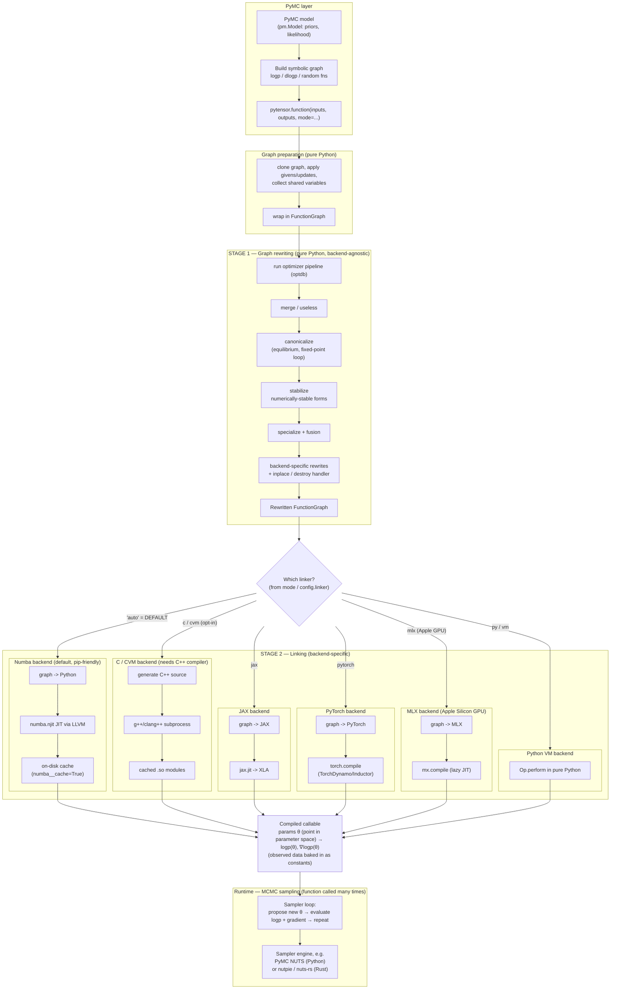

(compilation_for_pymc_users)=
# Understanding PyTensor compilation (a guide for PyMC users)

:::{note}
This page is deliberately *opinionated* and slightly broader in scope than the rest of the documentation: it explains PyTensor from the vantage point of someone who arrives at it **through PyMC** rather than using PyTensor directly. That framing is intentional — a large share of PyTensor users meet it at the top of the stack, via PyMC — but it does mean this guide makes some simplifications and value judgements that a pure-PyTensor reference would not.
:::

If you build models with PyMC, you don't usually call PyTensor yourself. But PyTensor is doing a lot of work on your behalf every time you sample, and understanding *what* it does helps explain two things PyMC users often wonder about:

- **Why does sampling sometimes take a while to even start?** (That's compilation.)
- **Why is the first run slow but later runs faster?** (That's caching.)

This guide gives you a mental model of the pipeline and the choices available, without assuming you've ever written a line of PyTensor.

## The one-sentence mental model

When PyMC samples your model, it asks PyTensor to turn the model's math (the log-probability and its gradient) into a fast, callable function. PyTensor does this in **two stages**: it first **rewrites** the symbolic math into a better form, then **links** that form into something executable using a chosen **backend**.

## The pipeline at a glance

<style>
div.mermaid { text-align: center; }
div.mermaid svg { width: 100% !important; max-width: 100% !important; height: auto !important; }
</style>



## Walking through the stages

### Graph preparation

PyMC hands PyTensor a symbolic graph — a recipe of mathematical operations, not yet any numbers. PyTensor clones it, resolves shared variables and updates, and wraps it in a `FunctionGraph`. This is bookkeeping; it's cheap.

### Stage 1 — rewriting (the "optimizer")

PyTensor rewrites the graph to be faster and more numerically stable. This is where, for example, a naive `log(1 + exp(x))` becomes a stable `softplus`, duplicate sub-expressions get merged, and element-wise operations get fused together. The heavy passes (`canonicalize`, `stabilize`, `specialize`) run to a *fixed point* — they keep applying rewrites until the graph stops changing.

Two things are worth internalising:

- **This stage is pure Python**, and its cost scales with the size of your graph. Large hierarchical models have large graphs, so this can be a real chunk of "time before sampling".
- **This stage is backend-agnostic.** Whether you end up on Numba, C, JAX, PyTorch, or MLX, the same rewriting happens first.

### Stage 2 — linking (choosing a backend)

The rewritten graph is turned into an executable. *How* depends on the linker/backend:

| Backend | How it compiles | Needs a system compiler? | Notes |
|---|---|---|---|
| **Numba** *(default)* | Converts the graph to Python, then JIT-compiles via LLVM | No (ships as wheels) | This is why `pip install pymc` "just works" without conda. First compile is slow; results are cached on disk. |
| **C / CVM** | Generates C++ source and compiles `.so` files with `g++`/`clang++` | Yes | Historically the default. Strong on-disk module cache. Now opt-in. |
| **JAX** | Converts to JAX, compiles via `jax.jit` → XLA | No | Great for GPU/TPU and `vmap`-style workflows. |
| **PyTorch** | Converts to PyTorch, compiles via `torch.compile` (TorchDynamo/Inductor) | No | Runs on PyTorch's CPU/GPU devices. |
| **MLX** | Converts to MLX, compiles via `mx.compile` | No | Targets Apple Silicon GPUs. |
| **Python VM** | Runs each operation's pure-Python implementation | No | Slowest at runtime, fastest to "compile". Handy for debugging. |

The default backend resolves from `config.linker = "auto"`, which currently maps to **Numba**.

### Runtime

Functionally, the compiled callable is a map from a **point in parameter space** to the model's **log-probability and its gradient**: `θ → (logp(θ), ∇logp(θ))`. The observed data isn't an argument — it's baked into the function as constants when the function is built. (PyMC actually compiles a few such functions: the log-density and its gradient for sampling, plus functions for drawing from priors/posterior predictive.)

An MCMC sampler calls this function thousands of times, proposing new parameter points and reading back `logp` and its gradient to decide where to go next. Time spent *here* is sampling time, which is separate from the compilation time described above — speeding up compilation does not speed up sampling, and vice versa.

The sampler engine that drives those calls is a separate choice from the PyTensor backend. It can be PyMC's built-in NUTS (Python), or an external sampler such as [nutpie](https://github.com/pymc-devs/nutpie), which runs the NUTS loop in Rust (via `nuts-rs`) while still calling a PyTensor-compiled logp/gradient under the hood. The Rust there is the *sampler*, not a PyTensor compilation backend — a useful distinction, since it's easy to assume "the fast Rust thing" is doing the compilation when in fact PyTensor still builds the function it evaluates.

## Caching: why the second run is faster

PyTensor caches the **linked artifact** so repeated builds can skip recompilation:

- **Numba** keeps an on-disk cache (enabled by default via `numba__cache`).
- **C / CVM** caches compiled `.so` modules in your compile directory.

Note a current limitation that matters in practice: the cache is for the *linked* output. Stage 1 rewriting is **not** cached and is re-run on every build, even for a structurally identical model.

## Practical tips for PyMC users

- **Iterating on model structure? Compile faster, run slower.** Use the `FAST_COMPILE` mode, which skips many rewrites and uses the pure-Python VM (no C/LLVM compilation at all). In PyMC you can often pass this via `compile_kwargs={"mode": "FAST_COMPILE"}`. Switch back to the default for the real, long sampling run.
- **Want to know where the time goes?** Turn on profiling:

  ```python
  import pytensor
  pytensor.config.profile = True          # per-function rewrite vs link time
  pytensor.config.profile_optimizer = True  # per-rewrite breakdown
  ```

- **"It recompiles every morning."** That usually means the on-disk cache isn't being hit across sessions. Check that your compile directory is stable and not being cleared between runs.
- **Choosing a backend.** Stick with the default (Numba) unless you have a specific reason: JAX for GPU/TPU, PyTorch to integrate with the PyTorch ecosystem, MLX for Apple Silicon GPUs, C/CVM if you specifically need the C runtime characteristics.

## Where to go next

- {ref}`optimizations` — the catalogue of graph rewrites applied in Stage 1.
- {ref}`using_modes` — modes and linkers in more depth.
- {doc}`library/compile/mode` — the `Mode` / linker API reference.
