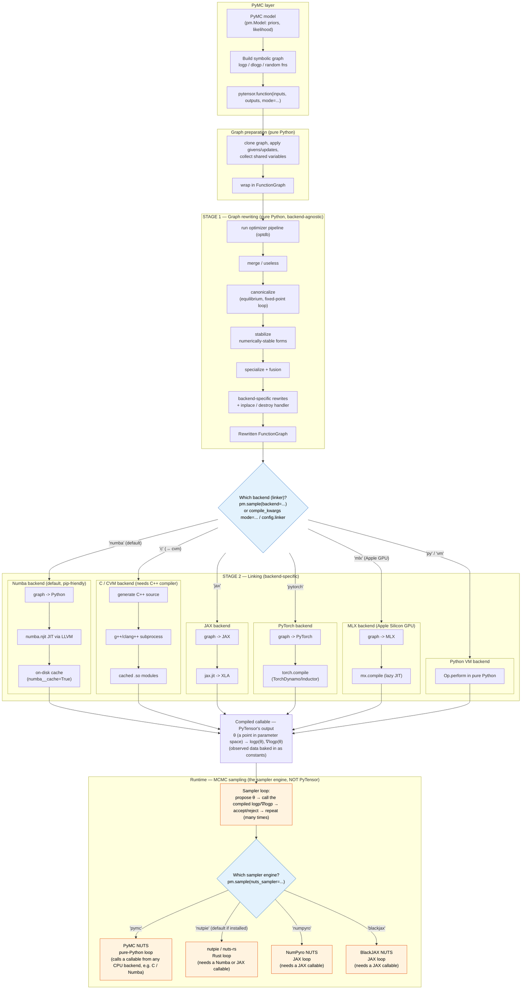

(compilation_for_pymc_users)=
# Understanding PyTensor compilation (a guide for PyMC users)

:::{note}
This page is deliberately *opinionated* and slightly broader in scope than the rest of the documentation: it explains PyTensor from the vantage point of someone who arrives at it **through PyMC** rather than using PyTensor directly. That framing is intentional — a large share of PyTensor users meet it at the top of the stack, via PyMC — but it does mean this guide makes some simplifications and value judgements that a pure-PyTensor reference would not.
:::

If you build models with PyMC, you don't usually call PyTensor yourself. But PyTensor is doing a lot of work on your behalf every time you sample, and understanding *what* it does helps explain two things PyMC users often wonder about:

- **Why does sampling sometimes take a while to even start?** (That's compilation.)
- **Why is the first run slow but later runs faster?** (That's caching.)

This guide gives you a mental model of the pipeline and the choices available, without assuming you've ever written a line of PyTensor.

## The one-sentence mental model

When PyMC samples your model, it asks PyTensor to turn the model's math (the log-probability and its gradient) into a fast, callable function. PyTensor does this in **two stages**: it first **rewrites** the symbolic math into a better form, then **links** that form into something executable using a chosen **backend**.

## The pipeline at a glance

<style>
/* Force the Mermaid diagram to use the full available page width.
   Mermaid inlines a `max-width` on the generated <svg>, so we override it. */
div.mermaid,
.mermaid {
    text-align: center;
    width: 100%;
    max-width: 100% !important;
}
div.mermaid svg,
.mermaid svg {
    width: 100% !important;
    max-width: 100% !important;
    height: auto !important;
}
</style>



## Walking through the stages

### Graph preparation

PyMC hands PyTensor a symbolic graph — a recipe of mathematical operations, not yet any numbers. PyTensor clones it, resolves shared variables and updates, and wraps it in a `FunctionGraph`. This is bookkeeping; it's cheap.

### Stage 1 — rewriting (the "optimizer")

PyTensor rewrites the graph to be faster and more numerically stable. This is where, for example, a naive `log(1 + x)` becomes a stable `log1p(x)`, duplicate sub-expressions get merged, and element-wise operations get fused together. Two things are worth internalising up front: **this stage is pure Python**, and its cost scales with the size of your graph (large hierarchical models have large graphs, so this can be a real chunk of "time before sampling"); and **this stage is backend-agnostic** — whether you end up on Numba, C, JAX, PyTorch, or MLX, almost all of the same rewriting happens first.

The subsections below walk through the boxes in the diagram's "Stage 1" lane, in order. Each names the module or function that implements it, so you can jump into the source.

#### The optimizer pipeline (`optdb`)

Every rewrite lives in one big, ordered registry: `pytensor.compile.mode.optdb`, an instance of `pytensor.graph.rewriting.db.SequenceDB`. Entries are registered at a numeric `position` (merge at `0`, `canonicalize` at `1`, `stabilize` at `1.5`, `specialize` at `2`, fusion at `49`, inplace at `49.5`+), and the pipeline runs them in that order. Each entry also carries *tags* such as `"fast_run"`, `"fast_compile"`, `"numba"`, or `"inplace"`.

Which entries actually run is decided by the {class}`pytensor.compile.mode.Mode` you compile with. A `Mode` pairs a *linker* (Stage 2) with an *optimizer query* (`pytensor.graph.rewriting.db.RewriteDatabaseQuery`) that selects rewrites by tag. For instance the default Numba mode queries `include=["fast_run", "numba"]`, while `FAST_COMPILE` queries `include=["fast_compile", "py_only"]` and so skips most of the pipeline. This is exactly the knob `FAST_COMPILE` and friends are turning.

#### `merge` / `useless`

The first passes are cheap clean-ups. **Merge** (`pytensor.graph.rewriting.basic.MergeOptimizer`, registered as `merge1`, `merge1.1`, `merge2`, `merge3` at several positions) collapses identical sub-graphs so a repeated expression is computed once. **Useless** (the `"useless"` entry at position `0.6`, a `pytensor.graph.rewriting.db.TopoDB` over a `LocalGroupDB` of small `local_useless_*` node rewriters) strips nodes that don't affect the output, e.g. an identity reshape or a fill that broadcasts to a shape already in hand.

#### `canonicalize` (fixed-point loop)

**Canonicalize** (position `1`) rewrites the graph into a single normal form so that later passes only have to recognise one shape of each pattern. It is an `pytensor.graph.rewriting.db.EquilibriumDB`: it applies all of its member rewrites repeatedly until the graph stops changing (reaches *equilibrium* / a fixed point). Developers add a local rewrite here with the `@register_canonicalize` decorator from `pytensor.tensor.rewriting.basic`. Typical work: reordering and flattening `add`/`mul` chains, folding constants, and pushing operations into a canonical position.

#### `stabilize` (numerically-stable forms)

**Stabilize** (position `1.5`, also an `EquilibriumDB`, populated via `@register_stabilize`) swaps numerically fragile expressions for equivalent stable ones — the step PyMC users feel most, because log-probabilities are full of logs and exps. Concrete examples from `pytensor.tensor.rewriting.math`: `local_log1p` turns `log(1 + x)` into `log1p(x)`, `local_expm1` turns `exp(x) - 1` into `expm1(x)`, and `local_log1p_plusminus_exp` turns `log1p(exp(x))` into `log1pexp(x)` (the softplus). These avoid catastrophic cancellation and overflow that the naive forms suffer near the extremes.

#### `specialize` + `fusion`

**Specialize** (position `2`, `EquilibriumDB`, `@register_specialize`) replaces general operations with faster special-cased ones (for example rewriting `x ** 2` or `sum(x**2)` into cheaper equivalents). **Fusion** then merges many element-wise operations into a single `Composite` op so the runtime walks the data once instead of allocating a temporary per operation: see the `"elemwise_fusion"` sequence (the `FusionOptimizer`) and `"add_mul_fusion"` in `pytensor.tensor.rewriting.elemwise`. Fusion is tagged `"fusion"`, which is why `FAST_COMPILE` (and JAX, which does its own fusion) leave it out.

#### Backend-specific rewrites + inplace / destroy handler

Two kinds of rewrites run near the end. **Backend-specific** rewrites are pulled in by the mode's tag query — the Numba mode adds `"numba"`-tagged rewrites (`pytensor.tensor.rewriting.numba`), the JAX mode adds `"jax"`-tagged ones (`pytensor.tensor.rewriting.jax`), and so on; conversely C-only ops and BLAS rewrites are *excluded* for the array-library backends. **Inplace** rewrites (tagged `"inplace"`) let ops write into their inputs' memory to avoid allocations: `AddDestroyHandler` (position `49.5`) first attaches a `pytensor.graph.destroyhandler.DestroyHandler` that tracks which buffers may be clobbered, then rewrites like `InplaceElemwiseOptimizer` (`pytensor.tensor.rewriting.elemwise`, position `50.5`) switch ops to their in-place variants. JAX excludes inplace entirely, since it manages memory itself.

#### Rewritten FunctionGraph

The output of Stage 1 is a new {class}`pytensor.graph.fg.FunctionGraph` — the same inputs and outputs, but a leaner, more stable, backend-tailored computation. Nothing has been compiled yet; that is Stage 2's job. (To inspect this graph without compiling a full function, apply the rewrites directly with `pytensor.graph.rewriting.utils.rewrite_graph(y, include=("canonicalize", "specialize"))` and print the result with `pytensor.dprint`.)

### Stage 2 — linking (choosing a backend)

The rewritten graph is turned into an executable. *How* depends on the linker/backend:

| Backend | How it compiles | Needs a system compiler? | Notes |
|---|---|---|---|
| **Numba** *(default)* | Converts the graph to Python, then JIT-compiles via LLVM | No (ships as wheels) | This is why `pip install pymc` "just works" without conda. First compile is slow; results are cached on disk. |
| **C / CVM** | Generates C++ source and compiles `.so` files with `g++`/`clang++` | Yes | Historically the default. Strong on-disk module cache. Now opt-in. |
| **JAX** | Converts to JAX, compiles via `jax.jit` → XLA | No | Great for GPU/TPU and `vmap`-style workflows. |
| **PyTorch** | Converts to PyTorch, compiles via `torch.compile` (TorchDynamo/Inductor) | No | Runs on PyTorch's CPU/GPU devices. |
| **MLX** | Converts to MLX, compiles via `mx.compile` | No | Targets Apple Silicon GPUs. |
| **Python VM** | Runs each operation's pure-Python implementation | No | Slowest at runtime, fastest to "compile". Handy for debugging. |

The default backend resolves from `config.linker = "auto"`, which currently maps to **Numba**.

#### How the backend gets chosen

Just as `nuts_sampler=` picks the sampler engine, a different knob picks the PyTensor backend. From PyMC, the simplest way is the `backend=` argument to `pm.sample`:

```python
import pymc as pm

with model:
    # Default-ish: Numba. Other common choices: "c", "jax".
    idata = pm.sample(backend="numba")
```

Under the hood, PyMC turns `backend=` into a PyTensor *compilation mode* (note that `backend="c"` maps to PyTensor's combined C+VM mode, `"cvm"`). If you need finer control you can pass a mode directly via `compile_kwargs` instead — but you can only set one of the two:

```python
with model:
    # Equivalent to backend="jax"; do NOT also pass backend=...
    idata = pm.sample(compile_kwargs={"mode": "JAX"})
```

If you're calling PyTensor directly (no PyMC), the same choice is made with `config.linker` for the whole session, or per call via the `mode` argument to `pytensor.function`:

```python
import pytensor

# Session-wide default for every compiled function
pytensor.config.linker = "jax"

# Or per function, overriding the session default
f = pytensor.function([x], y, mode="NUMBA")
```

The two choices — backend and sampler — are made at different points in the pipeline (see the two blue decision diamonds in the diagram), and as noted below they're mostly independent. The exception is that JAX-based samplers force the JAX backend.

#### How linking works (the shared mechanism)

Every backend is implemented as a *linker*, a subclass of `pytensor.link.basic.Linker`; the {class}`pytensor.compile.mode.Mode`'s linker is what Stage 2 runs. Most linkers share one trick: a single-dispatch registry that translates each PyTensor `Op` into the target language. Numba uses `pytensor.link.numba.dispatch.numba_funcify`, JAX uses `pytensor.link.jax.dispatch.jax_funcify`, PyTorch uses `pytensor.link.pytorch.dispatch.pytorch_funcify`, and MLX uses `pytensor.link.mlx.dispatch.mlx_funcify`. To add backend support for a new `Op`, you register a function with the matching dispatcher. The C and Python backends are the exception: rather than a `*_funcify` registry, they ask each `Op` directly for code through `Op.c_code` or run its `Op.perform` method. The subsections below cover each branch of the diagram's "Stage 2" lane.

#### Numba (default)

`pytensor.link.numba.linker.NumbaLinker`. `numba_funcify` walks the rewritten `FunctionGraph` and emits one Python function that wires together each op's Numba implementation; `pytensor.link.numba.dispatch.numba_njit` then JIT-compiles it with [`numba.njit`](https://numba.readthedocs.io/en/stable/user/jit.html) via LLVM. The first call pays the compilation cost; afterwards it runs as native machine code. With `config.numba__cache = True` (the default) the compiled result is written to an on-disk cache (keyed per op, see `numba_funcify_and_cache_key`), so a later session can skip recompiling. Numba ships as wheels, which is why `pip install pymc` "just works" without a system compiler.

#### C / CVM

`pytensor.link.c.basic.CLinker` generates C++ for each op from its `Op.c_code`, compiles a `.so` with the system `g++`/`clang++`, and caches the module in your compile directory. The default `"cvm"` linker is `pytensor.link.vm.VMLinker` with `use_cloop=True`: a hybrid where a fast C "virtual machine" loop steps through op *thunks*, each of which may be C-compiled or fall back to Python. Pure `"c"` (`CLinker` / `OpWiseCLinker`) compiles as much of the graph into C as possible. This family was historically the default and has a strong on-disk module cache, but it needs a working C++ toolchain — hence the move to Numba for the pip story.

#### JAX

`pytensor.link.jax.linker.JAXLinker`. `jax_funcify` translates the graph into a JAX-traceable Python function, which the linker hands to {func}`jax.jit` → XLA. This is the GPU/TPU-friendly path, and it's also the backend the JAX samplers (`numpyro`, `blackjax`, and `nutpie` in JAX mode) consume directly.

#### PyTorch

`pytensor.link.pytorch.linker.PytorchLinker`. `pytorch_funcify` builds a PyTorch function, compiled with {func}`torch.compile` (TorchDynamo + Inductor), running on PyTorch's CPU/GPU devices.

#### MLX

`pytensor.link.mlx.linker.MLXLinker`. `mlx_funcify` builds an MLX function compiled lazily with `mx.compile`, targeting Apple Silicon GPUs.

#### Python VM

The reference backend: `pytensor.link.basic.PerformLinker` (or `pytensor.link.vm.VMLinker` with `use_cloop=False`) steps through the graph calling each op's `Op.perform` in pure Python. There is essentially no compilation step, so it is the fastest to "build" and the slowest to run — ideal for debugging, and what `FAST_COMPILE` uses.

### Runtime

Functionally, the compiled callable is a map from a **point in parameter space** to the model's **log-probability and its gradient**: `θ → (logp(θ), ∇logp(θ))`. The observed data isn't an argument — it's baked into the function as constants when the function is built. (PyMC actually compiles a few such functions: the log-density and its gradient for sampling, plus functions for drawing from priors/posterior predictive.)

An MCMC sampler calls this function many times, proposing new parameter points and reading back `logp` and its gradient to decide where to go next. Time spent *here* is sampling time, which is separate from the compilation time described above — speeding up compilation does not speed up sampling, and vice versa.

**This is the key boundary.** Everything above the compiled callable in the diagram is *PyTensor* turning your model's math into a function. Everything below it is a *sampler engine* repeatedly calling that function. The sampler is a separate piece of software with its own loop; PyTensor's job is finished once the callable exists.

You pick the engine with `pm.sample(nuts_sampler=...)`. The options are:

- **`"pymc"`** — PyMC's built-in NUTS. The loop is pure Python and calls a PyTensor callable from any CPU backend (typically C or Numba).
- **`"nutpie"`** — runs the NUTS loop in Rust (via [`nuts-rs`](https://github.com/pymc-devs/nutpie)). It calls a PyTensor callable compiled to either the **Numba** or the **JAX** backend. This is the default when nutpie is installed.
- **`"numpyro"`** — NumPyro's NUTS, whose loop runs in **JAX**. It requires the **JAX** backend.
- **`"blackjax"`** — BlackJAX's NUTS, also a **JAX** loop requiring the **JAX** backend.

So the engine and the PyTensor backend are *mostly* an independent choice, with one important coupling: the JAX-based engines (`numpyro`, `blackjax`, and `nutpie` in JAX mode) need PyTensor to have compiled the callable to JAX. PyMC handles wiring this up for you.

A common misconception is worth heading off: with nutpie it's easy to assume "the fast Rust thing" is doing the compilation. It isn't — the Rust is the *sampler loop*, not a PyTensor compilation backend. PyTensor still builds the logp/gradient function that the Rust loop evaluates.

## Caching: why the second run is faster

PyTensor caches the **linked artifact** so repeated builds can skip recompilation:

- **Numba** keeps an on-disk cache (enabled by default via `numba__cache`).
- **C / CVM** caches compiled `.so` modules in your compile directory.

Note a current limitation that matters in practice: the cache is for the *linked* output. Stage 1 rewriting is **not** cached and is re-run on every build, even for a structurally identical model.

## Practical tips for PyMC users

- **Iterating on model structure? Compile faster, run slower.** Use the `FAST_COMPILE` mode, which skips many rewrites and uses the pure-Python VM (no C/LLVM compilation at all). In PyMC you can often pass this via `compile_kwargs={"mode": "FAST_COMPILE"}`. Switch back to the default for the real, long sampling run.
- **Want to know where the time goes?** Turn on profiling:

  ```python
  import pytensor
  pytensor.config.profile = True          # per-function rewrite vs link time
  pytensor.config.profile_optimizer = True  # per-rewrite breakdown
  ```

- **"It recompiles every morning."** That usually means the on-disk cache isn't being hit across sessions. Check that your compile directory is stable and not being cleared between runs.
- **Choosing a backend.** Stick with the default (Numba) unless you have a specific reason: JAX for GPU/TPU, PyTorch to integrate with the PyTorch ecosystem, MLX for Apple Silicon GPUs, C/CVM if you specifically need the C runtime characteristics.

## Where to go next

- {ref}`optimizations` — the catalogue of graph rewrites applied in Stage 1.
- {ref}`using_modes` — modes and linkers in more depth.
- {doc}`library/compile/mode` — the `Mode` / linker API reference.
